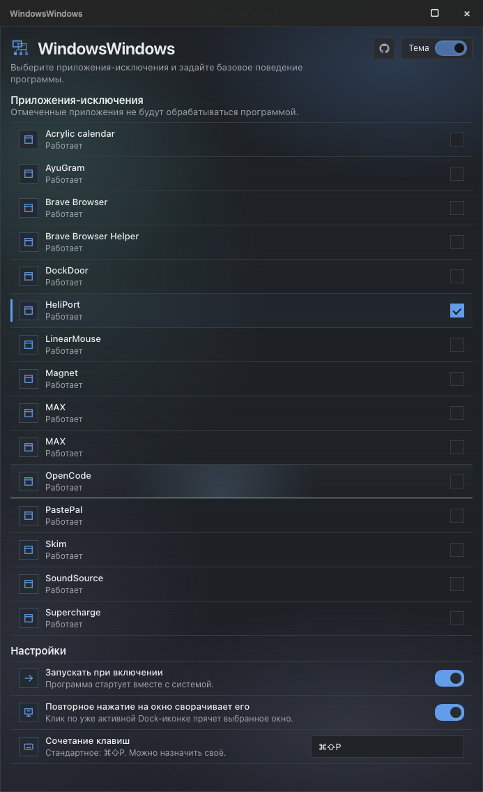
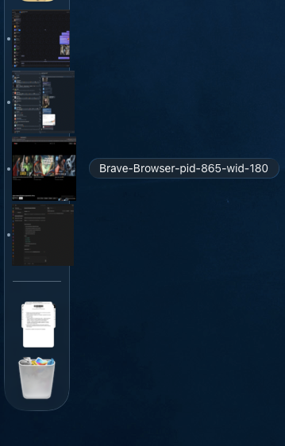

<p align="center">
  
</p>

<h1 align="center">WindowsWindows</h1>

<p align="center">
  Give every macOS window its own live Dock tile.
</p>

<p align="center">
  <a href="https://github.com/DurkaEbanaya/WindowsWindows/releases">Releases</a> ·
  <a href="#build-from-source">Build from source</a> ·
  <a href="#permissions">Permissions</a>
</p>

WindowsWindows turns individual windows from other applications into separate Dock tiles. Each generated tile follows one exact window, uses its current snapshot as the icon, and activates or closes that window without collapsing every window back into one application icon.

## Screenshots

| Settings | Individual window tiles |
| --- | --- |
|  |  |

## Features

- One generated Dock tile per discovered window.
- Live window previews powered by ScreenCaptureKit.
- Exact-window activation through macOS Accessibility APIs.
- Optional repeat-click minimization for the already focused window.
- Windows-style exact-window toggle for ordinary application icons in the macOS Dock, using each app's most recently focused window.
- Middle-click an ordinary Dock icon to quit its app, or a WindowsWindows proxy tile to close its exact window.
- Optional square acrylic window previews when hovering over an application or proxy icon in the Dock.
- Explicit **Close Window** action for a proxy tile.
- Application exclusions with immediate persistence.
- Global active-workspace traversal shortcuts: `Control+Command+←/→` by default.
- Optional Windows 10-style acrylic per-window switcher on `Option+Tab` with mouse selection (`Shift+Option+Tab` moves backward, `Esc` cancels).
- Independent switches for per-window Dock tiles and the `Option+Tab` switcher, including an Option+Tab-only mode.
- Launch at Login through `SMAppService`.
- Light and dark Settings themes.
- Background service lifecycle: closing Settings does not stop window tracking.
- Reopening the app brings Settings back without launching a second service instance.
- Dependency-free `wwctl` terminal configuration interface remains bundled for advanced use.

## Requirements

- macOS 14 Sonoma or later.
- Accessibility permission for window discovery, focus, and close actions.
- Screen & System Audio Recording permission for live Dock previews.
- Xcode 15 or later when building from source.

## Install

Download the latest build from [GitHub Releases](https://github.com/DurkaEbanaya/WindowsWindows/releases).

Current preview archives are ad-hoc signed and not notarized. macOS may require an explicit first-open confirmation. A stable Developer ID build is not available until the project has an Apple Developer signing identity and notarization pipeline.

## Using Settings

WindowsWindows has no permanent menu-bar item. Launch the app again while the service is running to open Settings.

Settings provides:

- **Application exclusions** — selected apps are not converted into per-window Dock tiles.
- **Launch at Login** — starts the service with the user session.
- **Minimize on repeated click** — clicking the tile of the already focused window hides that window.
- **Theme** — switches between light and dark Settings appearance.
- **Keyboard shortcut display** — shows the current traversal shortcut configuration.

Changes are written atomically and applied to the running service without a restart.

## Permissions

The first launch requests Accessibility and Screen Recording access.

If macOS opens **System Settings → Privacy & Security → Screen & System Audio Recording** without adding the app automatically, use `+` to add the installed `WindowsWindows.app`, enable it, and restart WindowsWindows.

A stable code-signing identity is preferable for daily use. Changing the app signature can make macOS request permissions again.

## Build from source

Open `WindowsWindows.xcodeproj`, select the **WindowsWindows** scheme, and run it.

Terminal build:

```sh
xcodebuild \
  -project WindowsWindows.xcodeproj \
  -scheme WindowsWindows \
  -configuration Release \
  -derivedDataPath .build \
  CODE_SIGNING_ALLOWED=NO \
  build

open .build/Build/Products/Release/WindowsWindows.app
```

The shared scheme post-action signs embedded executables and the app bundle. It uses an ad-hoc identity when the repository author's local identity is unavailable. To provide a stable local identity:

```sh
WINDOWSWINDOWS_SIGNING_IDENTITY=YOUR_IDENTITY_SHA1 xcodebuild \
  -project WindowsWindows.xcodeproj \
  -scheme WindowsWindows \
  -configuration Release \
  -derivedDataPath .build \
  CODE_SIGNING_ALLOWED=NO \
  build
```

## Configuration and diagnostics

Persistent state:

```text
~/Library/Application Support/WindowsWindows/config.json
```

The current schema is version 3. It contains the active workspace/profile, per-profile window ordering and application policy, hotkeys, Launch at Login, update-check preferences, behavior, and appearance. Older schema versions are migrated into the default workspace profile.

The GUI intentionally hides profile management for now. The runtime already stores profile-aware state and projects only the active profile into Dock proxies.

Diagnostics:

```text
~/Library/Application Support/WindowsWindows/diagnostics.jsonl
```

Generated proxy applications:

```text
~/Library/Application Support/WindowsWindows/ProxyApps/
```

### Terminal interface

For an app installed in `/Applications`:

```sh
"/Applications/WindowsWindows.app/Contents/Resources/wwctl"
```

Use `↑`/`↓` or `j`/`k` to navigate and `Space` to toggle an application. `wwctl` can edit application scope and refresh intervals, validates changes, writes atomically, and preserves malformed or unsupported future configuration instead of silently replacing it.

## Architecture

WindowsWindows combines:

- **Accessibility APIs** for exact-window discovery and control;
- **Core Graphics metadata** for stable process/window identity;
- **ScreenCaptureKit** for preview images;
- generated lightweight proxy app bundles for Dock integration;
- session-token-gated distributed notifications for proxy-to-owner IPC;
- process-lifetime metadata and a single-instance lock to prevent stale proxies from controlling a replacement process.

New live windows belong to the active workspace profile. One live window belongs to exactly one profile, and only active-profile windows are projected into Dock proxies.

## Updates

The app currently checks the verified GitHub Releases API for preview releases. The repository also reserves a future Sparkle appcast URL, but unattended Sparkle installation is not enabled until package integration, Ed25519 signing keys, Developer ID signing, notarization, and a published appcast exist.

## Limitations

- Public macOS APIs do not expose Dock tile order, Dock drag events, or named Dock groups.
- Proxy tiles are foreground applications and may appear briefly in app-switching UI.
- Some applications expose incomplete or unusual Accessibility metadata, so individual windows may be omitted or may not focus reliably.
- Preview capture requires Screen Recording permission; window tracking can continue when capture fails.
- GitHub preview builds are currently ad-hoc signed and not notarized.

## License

WindowsWindows is available under the [MIT License](LICENSE).
